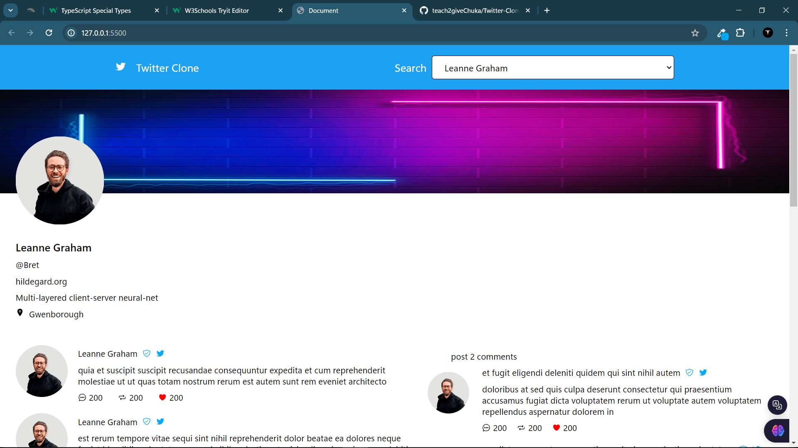

# Twitter-Clone-Weekend

## Table of contents

  - [Screenshot](#screenshot)
  - [Links](#links)
  - [Built with](#built-with)
  - [What I learned](#what-i-learned)

- [Author](#author)

## Overview
Task

Consume the users API and print all users by username on a select box (by default, display user with ID one)

On selecting a User Display the post that user has (by default, display user with ID 1)

On selecting a Post show all its comments. (by default, display comments for post with ID 1)

DEMO https://twitter-signals-7iou.vercel.app/

### Screenshot

...

### Links

- Solution URL: [Dummy Twitter Clone As per provided design](https://github.com/teach2giveChuka/Twitter-Clone-Weekend)
- Live Site URL: [Live page Visit ~ _ ~ ](https://teach2givechuka.github.io/Twitter-Clone-Weekend/)

## My process

### Built with

- Semantic HTML5 markup
- Vannila CSS
- Vannila JS

## Author
- : [Marshal-Emanuel](https://github.com/Marshal-Emanuel)

